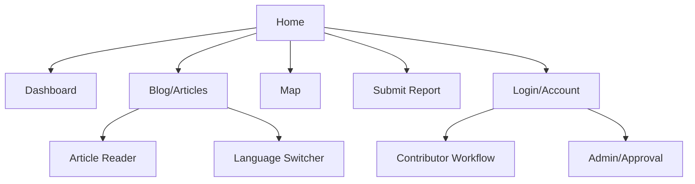
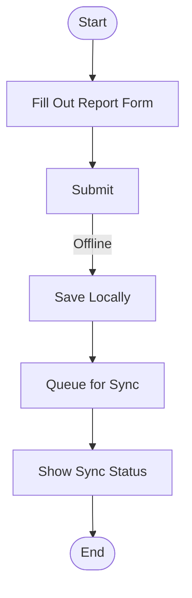

# LUaid PWA UI/UX Specification

## Introduction
This document defines the user experience goals, information architecture, user flows, and visual design specifications for the LUaid PWA’s user interface. It serves as the foundation for visual design and frontend development, ensuring a cohesive and user-centered experience.

---

## Overall UX Goals & Principles

### Target User Personas
- **Volunteer:** Submits field reports offline, often in low-connectivity, high-stress environments.
- **Community Contributor:** Writes and translates articles, may have limited technical experience.
- **Admin/Approver:** Reviews and manages multilingual submissions, configures site, ensures content quality.
- **Donor/NGO Staff:** Views dashboards and maps to monitor relief progress and transparency.
- **Disaster-Affected End User:** Accesses content offline, needs clear, up-to-date information in their language.

### Usability Goals
- **Offline-first:** All critical tasks (form submission, content reading) must work without connectivity.
- **Fast onboarding:** New users can complete core tasks (e.g., submit a report, read an article) within 5 minutes.
- **Role clarity:** Users always know what actions are available to them.
- **Error prevention:** Clear validation, feedback, and confirmation for all actions.
- **Accessibility:** Interfaces are usable in low-light, low-bandwidth, and for users with partial visual impairment.

### Core Design Principles
1. **Clarity over cleverness:** Prioritize clear communication and guidance.
2. **Progressive disclosure:** Show only what’s needed, when it’s needed.
3. **Consistent patterns:** Use familiar UI patterns throughout the application.
4. **Immediate feedback:** Every action should have a clear, immediate response.
5. **Accessible by default:** Design for all users from the start.

---

## Information Architecture (IA)

### Site Map / Screen Inventory

### Navigation Structure
**Primary Navigation:** Home, Dashboard, Blog/Articles, Map, Submit Report, Account/Login

**Secondary Navigation:** Language Switcher, Role-based workflow tabs (Contributor, Admin)

**Breadcrumb Strategy:** Shown for nested content (e.g., Article > Edit > Approve)

---

## User Flows

### Volunteer: Submit Field Report (Offline)
- **User Goal:** Submit a field report even when offline
- **Entry Points:** Home, Dashboard, direct link
- **Success Criteria:** Report is saved locally and queued for sync

**Edge Cases & Error Handling:**
- Device storage full
- User closes app before sync
- Form validation errors

---

### Contributor: Write/Translate Article
- **User Goal:** Submit or translate an article for review
- **Entry Points:** Account/Login > Contributor Workflow
- **Success Criteria:** Article is submitted and visible for approval

---

### Admin/Approver: Review Submissions
- **User Goal:** Approve or reject content
- **Entry Points:** Account/Login > Admin/Approval
- **Success Criteria:** Content is published or sent back for revision

---

### Donor/NGO: View Dashboard & Map
- **User Goal:** See up-to-date relief data and deployment zones
- **Entry Points:** Home, Dashboard, Map
- **Success Criteria:** Data loads quickly, fallback to cached if offline

---

### End User: Read Articles Offline
- **User Goal:** Access information in their language, even offline
- **Entry Points:** Home, Blog/Articles
- **Success Criteria:** Content is readable, language switcher works, update status shown

---

## Wireframes & Mockups
- Primary design files to be created in Figma (link to be added)
- Key screens: Home, Dashboard, Article Reader, Report Form, Map, Contributor Workflow, Admin Panel
- Layouts: Mobile-first, responsive, uncluttered

---

## Component Library / Design System
- **Design System Approach:** Custom, with reusable components for forms, cards, navigation, status banners, and language switcher
- **Core Components:**
  - Button (primary, secondary, disabled)
  - Form fields (text, select, file upload)
  - Card (dashboard, article preview)
  - Modal/Dialog (confirmations, errors)
  - Banner (staging/prod, sync status)
  - Language Switcher
  - Map Widget
  - Dashboard Chart

---

## Branding & Style Guide
- **Brand Guidelines:** LUaid logo, disaster transparency theme, culturally neutral
- **Color Palette:**
  - Primary: #1976D2 (Blue) – navigation, buttons
  - Secondary: #263238 (Charcoal) – backgrounds, text
  - Accent: #FFC107 (Amber) – highlights, status
  - Success: #388E3C (Green)
  - Warning: #FFA000 (Orange)
  - Error: #D32F2F (Red)
  - Neutral: #FFFFFF, #F5F5F5, #B0BEC5 (White, light gray, gray)
- **Typography:**
  - Primary: Inter, Arial, sans-serif
  - Large, legible, high-contrast
- **Iconography:**
  - Material Icons or similar, optimized for tap targets
- **Spacing & Layout:**
  - 8px grid, responsive breakpoints for mobile, tablet, desktop

---

## Accessibility Requirements
- **Standard:** WCAG 2.1 AA
- **Visual:**
  - High color contrast for text and UI
  - Focus indicators on all interactive elements
  - Adjustable text size
- **Interaction:**
  - Full keyboard navigation
  - Screen reader support
  - Large tap targets
- **Content:**
  - Alt text for all images
  - Clear heading structure
  - Proper form labels
- **Testing:**
  - Use Lighthouse, axe, and manual testing on real devices

---

## Responsiveness Strategy
- **Breakpoints:**
  - Mobile: 320–600px (primary target)
  - Tablet: 601–1024px
  - Desktop: 1025–1440px
  - Wide: 1441px+
- **Adaptation Patterns:**
  - Mobile-first layouts
  - Collapsible navigation
  - Content prioritization for small screens
  - Touch-friendly interactions

---

## Animation & Micro-interactions
- Minimal, purposeful animations (e.g., button press, sync status)
- Avoid heavy transitions for performance and battery
- Feedback for form submission, sync, and errors

---

## Performance Considerations
- **Page Load:** <2s on 3G
- **Interaction Response:** <100ms for UI feedback
- **Animation FPS:** 60fps for all transitions
- **Design Strategies:**
  - Lazy load images and data
  - Cache-first for offline
  - Optimize assets for low bandwidth

---

## Next Steps
1. Review with stakeholders
2. Create/update visual designs in Figma
3. Prepare for handoff to frontend development
4. Address any open questions or decisions

**Design Handoff Checklist:**
- [x] All user flows documented
- [x] Component inventory complete
- [x] Accessibility requirements defined
- [x] Responsive strategy clear
- [x] Brand guidelines incorporated
- [x] Performance goals established